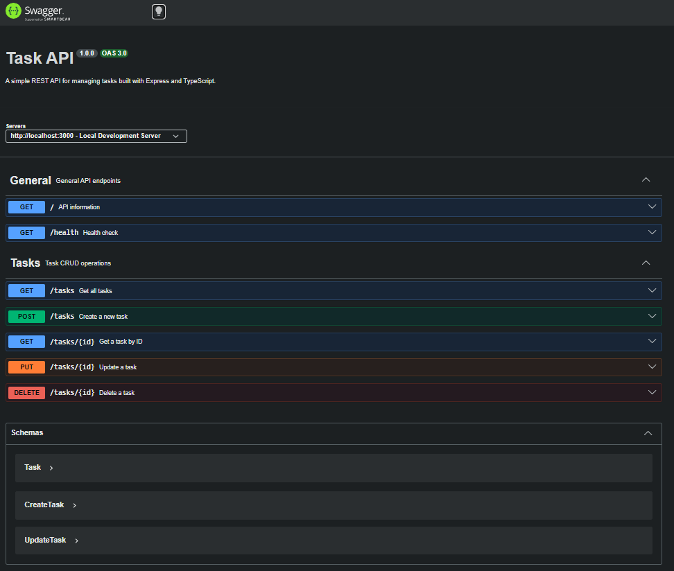

# Task API

A simple RESTful Task API built with **Node.js**, **Express.js**, and **TypeScript**. It demonstrates the fundamental CRUD (Create, Read, Update, Delete) operations for managing tasks and includes interactive API documentation using **Swagger UI (OpenAPI 3.0)**.

## Features

- Create a task
- Get all tasks
- Get a task by ID
- Update a task
- Delete a task
- Health check endpoint
- Interactive API documentation with Swagger UI

---

## Prerequisites

Before running this project, make sure you have:

- Node.js (v18 or later recommended)
- npm

---

## Installation & Running

Clone the repository:

```bash
git clone https://github.com/Francis054/to-do-api.git
cd to-do-api
```

Install dependencies:

```bash
npm install
```

Run the development server:

```bash
npm run dev
```

The API will be available at:

```
http://localhost:3000
```

Swagger documentation:

```
http://localhost:3000/docs
```

---

## API Endpoints

| Method | Endpoint | Description |
| :----- | :------- | :---------- |
| GET | `/` | Returns API information |
| GET | `/health` | Health check endpoint |
| GET | `/tasks` | Returns all tasks |
| GET | `/tasks/:id` | Returns a single task by ID |
| POST | `/tasks` | Creates a new task |
| PUT | `/tasks/:id` | Updates an existing task |
| DELETE | `/tasks/:id` | Deletes a task |

---

## Example Request

Create a new task:

```bash
curl -i -X POST http://localhost:3000/tasks \
-H "Content-Type: application/json" \
-d "{\"title\":\"Learn Swagger\"}"
```

### Example Output

```http
HTTP/1.1 201 Created
X-Powered-By: Express
Content-Type: application/json; charset=utf-8
Content-Length: 49
ETag: W/"31-xxxxxxxxxxxxxxxxxxxxxxxx"
Date: Sun, 19 Jul 2026 10:15:30 GMT
Connection: keep-alive
Keep-Alive: timeout=5

{
  "id": 4,
  "title": "Learn Swagger",
  "done": false
}
```

---

## Swagger UI

Interactive API documentation is available at:

```
http://localhost:3000/docs
```

Documentation UI





---

## Project Structure

```
to-do-api/
│
├── node_modules/
├── openapi.json
├── package.json
├── tsconfig.json
├── server.ts
├── README.md
└── images/
    └── swagger-doc-ui.png
```

---

## Technologies Used

- TypeScript
- Node.js
- Express.js
- Swagger UI Express
- OpenAPI 3.0

---

## Author

**Francis Dey**